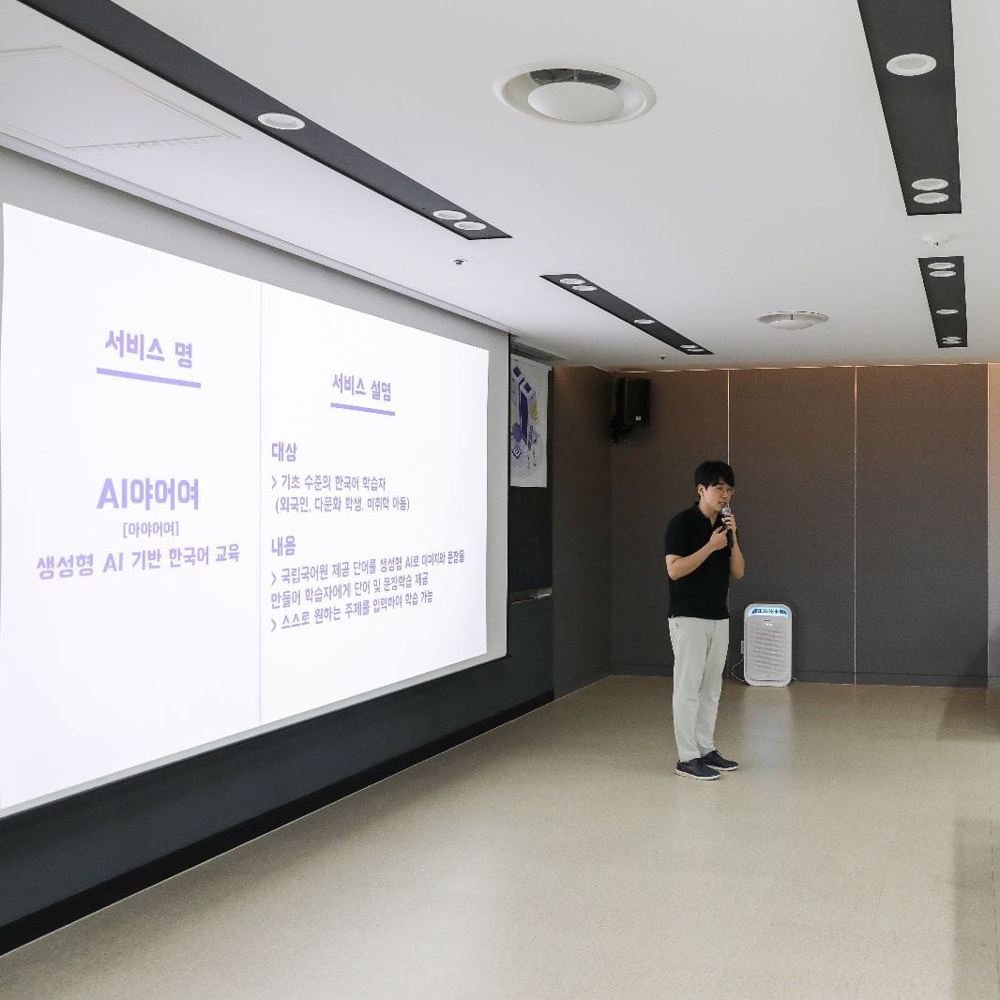
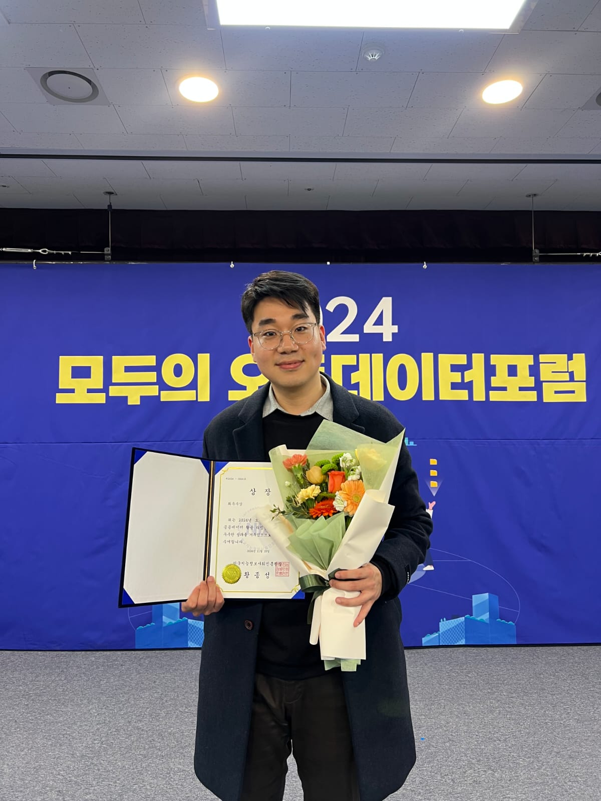

  
   

---
# About me

Hello, I am **Junbeom Lee**👋.

I am a software developer specializing in Python backend engineering, with a strong interest in machine learning and data. 

For three years, I worked as a teacher in South Korea while pursuing programming as a hobby.
However, my dream of creating impactful services for people led me to leave teaching and pursue a career in software development.
Recently, I moved to Montreal, Canada to realize my goal of becoming an engineer in North America. 

I am open to any opportunities where I can demonstrate my potential as a software engineer. 

Here is my [**Resume**](https://drive.google.com/file/d/1D8XSD4pxiQg8PPT66fUnIxx5Brg0v6-V/view?usp=sharing)

---

# About this website
This website showcases my projects and blog posts.

- 📁 My portfolio includes projects related to AI and open-source contributions.
- ✒️ My blog posts cover various topics, such as computer science, AI and personal journals.

---
# Contact

Feel free to contact me via [**email**](mailto:g4012s@gmail.com) or [**LinkedIn DM**](https://www.linkedin.com/in/tbeom15/). 
